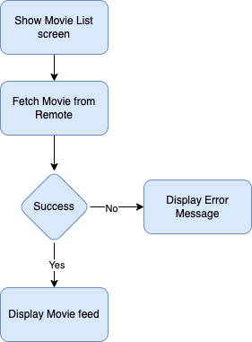

# Movie List
[](https://github.com/viral7chauhan/MovieList/actions/workflows/CI.yml)

List out Movies from *the Movie db* using pagination, this app is demo project for interview
- App using MVVM architecure
- App should contains unit test


## BDD

### Story: Customer request to see Movie feeds
### Narrative #1

```
As an online customer
I want the app to automatically load my latest movie feed
also can see details of Movie
Add movie into favorite list
```

#### Scenarios (Acceptance criteria)

```
Given the customer doesn't have connectivity
 Then the app should display error message 

Given the customer have connectivity
 Then the app should display Movie
```

## Use Cases

### Load Movie From Remote Use Case

#### Data:
- URL
- PageNumber

#### Primary course (happy path):
1. Execute "Load Movie Feed" command with above data.
2. System downloads data from the URL.
3. System creates Movie feed data.
4. System delivers Movie feed.

#### Invalid data – error course (sad path):
1. System delivers invalid data error.

#### No connectivity – error course (sad path):
1. System delivers connectivity error.

## Flowchart



## Model Specs

### Movie Feed

| Property          | Type                |
|-------------------|---------------------|
| `title`           | `String`            |
| `originalTitle`   | `String`            |
| `thumbnailImage`  | `String`            |
| `bannerImage`     | `String`            |
| `overview`        | `String`            |
| `popularity`      | `Double`            |
| `releaseDate`	    | `Date`              |
| `voteCount`	    | `Int`               |
| `isFavorite`	    | `Bool`              |

### Payload contract

```
GET *url* 
200 RESPONSE
{
  "page": 1,
  "results": [
    {
      "adult": false,
      "backdrop_path": "/fLDo1GXZWuBpMRkrzITYzBufath.jpg",
      "genre_ids": [
        10751,
        35,
        18,
        14,
        9648,
        53
      ],
      "id": 987919,
      "original_language": "en",
      "original_title": "A Christmas Mystery",
      "overview": "When her best friend's father is falsely accused of stealing the town's prized jingle bells, a young amateur sleuth and her friends must find the real thief before Christmas.",
      "popularity": 508.056,
      "poster_path": "/7ROhQeFIRCDadpIe4C7fVi5mV1Q.jpg",
      "release_date": "2022-11-24",
      "title": "A Christmas Mystery",
      "video": false,
      "vote_average": 8.1,
      "vote_count": 7
    },
    {
      "adult": false,
      "backdrop_path": "/hNzrnsH9FMMfITu2xQqaf70CRv5.jpg",
      "genre_ids": [
        9648,
        14,
        53
      ],
      "id": 856245,
      "original_language": "es",
      "original_title": "Matar a la Bestia",
      "overview": "Emilia arrives at her Aunt Inés' hostel located on the Argentina-Brazil border, looking for her missing brother. In this lush jungle a dangerous beast which takes the form of different animals seems to be roaming around.",
      "popularity": 548.132,
      "poster_path": "/hAdkgE8lHelIQWpgrHk4wjEnbxQ.jpg",
      "release_date": "2022-04-28",
      "title": "To Kill the Beast",
      "video": false,
      "vote_average": 5.6,
      "vote_count": 30
    },
    ...
}
```
